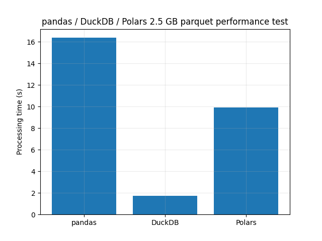

# SynthCity Parquet Performance

*A quick performance test of pandas, DuckDB, and Polars using a SynthCity parquet dataset*

### Background

Larger datasets can really bring Python Pandas to a crawl and require lots of RAM, which can really slow down analysis.

I wanted to explore a couple of pandas alternatives to see if I could increase performance without scaling up to a server solution like PostgreSQL or Apache Spark.

I chose to evaluate [pandas](https://pandas.pydata.org/), [DuckDB](https://duckdb.org/), and [Polars](https://www.pola.rs/) on the largest publicly available parquet dataset I could find, a synthetic lidar point cloud called [SynthCity](https://www.synthcity.xyz/). On the [downloads](https://www.synthcity.xyz/download.html) page there is a link to *Test area only (area 3)* which will download a 2.5 GB *area3.parquet* file.

Despite the name, DuckDB is as simple to install as any other Python package: `pip install duckdb`. Think of DuckDB as a SQL interface to csv files, parquet files, and most interestingly pandas dataframes. One amazing DuckDB optimization is the ability to load a single column of a parquet file at a time. Neat!

The other contender is Polars, a Rust based dataframe library. Polars bills itself as lightning fast and boasts a different API style than the often criticized pandas. So far I still prefer pandas, but it just might be my familiarity with it. 

### Test

In order to evaluate each library, I timed a basic analytics flow:

1. Store the column names of the parquet file
2. Store the maximum value of the *R* column
3. Store the minimum value of the *G* column
4. Store the mean of the *B* column

While pandas and Polars require the slow operation of importing the entire parquet file, DuckDB zooms ahead by only reading the information required from the parquet file, a feature called [pushdown](https://duckdb.org/2021/12/03/duck-arrow.html).

### Results

These results are not necessarily rigorous, the processing time bar chart was generated from a single (but representative) run rather than a series of tests and accompanying statistics. Regardless, DuckDB has the shortest processing time (good) by a wide margin:

### Conclusion

After learning about the parquet pushdown features of DuckDB I expected it to have the best performance -- and it delivered! DuckDB performed this small analytics test 4 - 7x faster than pandas or Polars.

Both DuckDB and Polars require learning new syntax, though DuckDB's SQL API will be familiar to most data folks.

DuckDB integrates really well with pandas. For example, I was able to port the heavy lifting queries of a pandas project into DuckDB, save the results as a pandas dataframes, and plot them using my existing Matplotlib code. Too cool!

### Files

- **.gitignore**: GitHub Python git ignore file sourced [here](https://github.com/github/gitignore/blob/main/Python.gitignore), modified to ignore .parquet files
- **LICENSE**: project license 
- **requirements.txt**: Python required modules list
- **synthcity_parquet_performance.py**: source Python file
- **synthcity_parquet_performance.png**: processing time bar chart image
